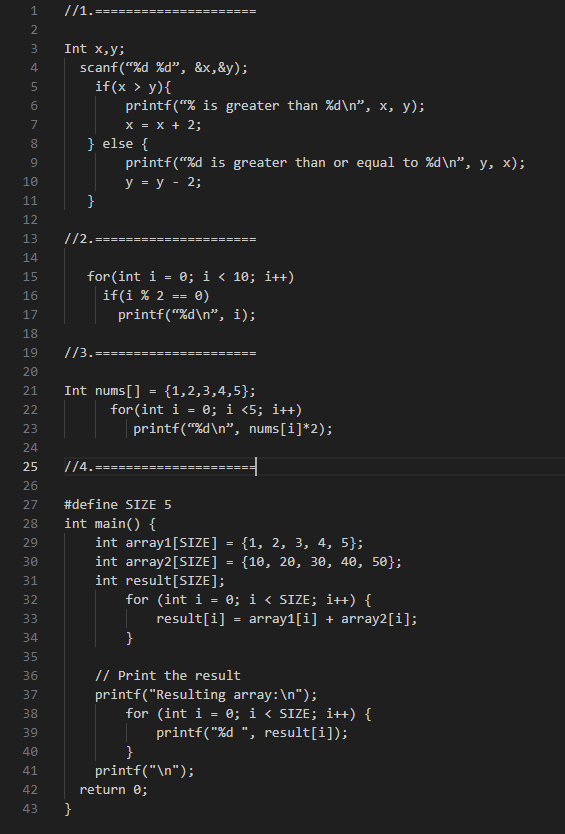
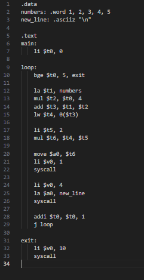
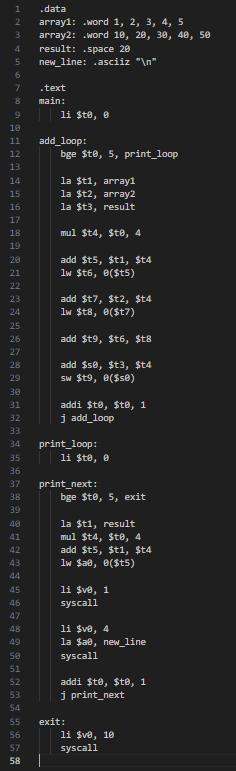
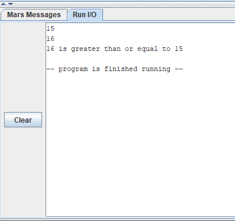
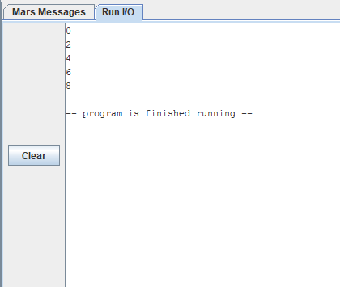
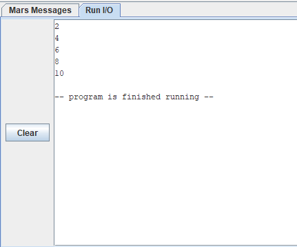
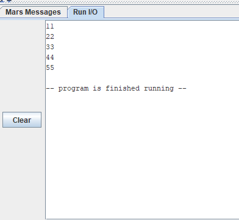

# MIPS Assembly Practice – Student Projects

This repository contains four beginner-level MIPS assembly programs written and tested using the [MARS simulator](http://courses.missouristate.edu/KenVollmar/MARS/). These programs are based on basic C code exercises (conditionals, loops, arrays) and rewritten step-by-step in MIPS to help understand how low-level logic works.

---
## My Homework

### Original C Code

### Converted MIPS Code

  
  
  
  

---
## Overview

Each file in this project is a simple translation of a small C program into MIPS. No macros, no shortcuts — just basic student-style code using core instructions and syscalls.

| File Name             | Description                                 |
|----------------------|---------------------------------------------|
| `q1_compare.asm`     | Compare two integers and apply conditions   |
| `q2_even_numbers.asm`| Print even numbers from 0 to 9              |
| `q3_array_double.asm`| Print double the value of each array element|
| `q4_array_add.asm`   | Add two arrays and print the result         |

---

## How to Run

You can run these files in the **MARS MIPS Simulator**:

1. Download [MARS.jar](http://courses.missouristate.edu/KenVollmar/MARS/)
2. Open the `.asm` file
3. Assemble (`F3`)
4. Run (`F5`) and enter input if needed

---

## Screenshots

### Running `q1_compare.asm`

### Running `q2_even_numbers.asm`

### Running `q3_array_double.asm`

### Running `q4_array_add.asm`

---

## What I Learned

- Using `syscall` for input/output
- Comparing values with `bgt`, `ble`, `beq`
- Looping with `addi`, `slt`, and labels
- Working with arrays in memory (`la`, `lw`, `sw`)
- Keeping code clean and readable

---
